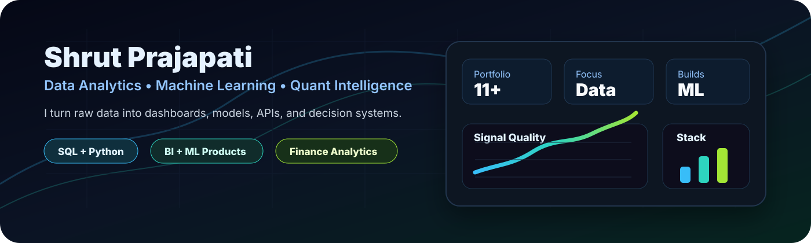

  

<h1 align="center">Shrut Prajapati</h1>

  Data Analytics & Business Intelligence | Machine Learning | Analytics Engineering | Quant-Finance Projects

  
  
  

---

## What I Build

I build analytics products that turn messy business and market data into clear decisions: SQL models, BI dashboards, ML scoring systems, and end-to-end data applications.

Currently focused on:

- Production-style analytics engineering with Python, SQL, dbt-style modeling, and cloud data platforms
- Machine learning workflows for classification, forecasting, NLP, and explainability
- Finance and quant analytics projects with backtesting, risk metrics, and trading intelligence
- Executive-ready dashboards in Power BI, Tableau, Streamlit, and modern web apps

---

## Featured Work

| Project | What It Shows | Stack |
|---|---|---|
| [AlphaSignal](https://github.com/Shrut1261/alphasignal-market-intelligence) | Algorithmic trading intelligence platform with market ingestion, sentiment, ML signals, backtesting, FastAPI, and dashboard delivery | Python, FastAPI, TimescaleDB, ML, Next.js |
| [DenialGuard AI](https://github.com/Shrut1261/healthcare-denial-risk-ai) | Healthcare claim denial risk predictor with model scoring, driver analysis, and operational recommendations | Python, Streamlit, ML |
| [Portfolio](https://github.com/Shrut1261/analyst) | Modern project portfolio with dedicated case-study pages and dynamic project previews | HTML, CSS, JavaScript |
| [Credit Card Churn Prediction](https://github.com/Shrut1261/credit-card-churn-prediction) | Customer attrition modeling and business-focused churn insights | R, ML, EDA |

---

## Technical Toolkit

**Analytics & BI:** SQL, Power BI, Tableau, Excel, KPI design, dashboard storytelling  
**Data Engineering:** Python, PostgreSQL, T-SQL, Snowflake, Microsoft Fabric, Azure, ETL pipelines  
**Machine Learning:** scikit-learn, forecasting, classification, NLP, model evaluation, feature engineering  
**Application Layer:** FastAPI, Streamlit, HTML/CSS/JavaScript, GitHub Actions, Docker  
**Finance Analytics:** backtesting, Sharpe ratio, drawdown, alpha/beta, portfolio optimization concepts

  
  
  
  
  
  
  
  

---

## GitHub Activity

  
  

  

---

## Interview Narrative

I bring a business intelligence foundation with hands-on data product execution: clean SQL, measurable dashboards, practical ML, and full-stack portfolio projects that demonstrate how analysis becomes a usable product.

I am especially interested in Data Analyst, Analytics Engineer, Data Engineer, Quant Analytics, and ML-adjacent analytics roles where the work connects data quality, modeling, decision systems, and business outcomes.

---

  <b>Portfolio:</b> <a href="https://shrut1261.github.io/analyst/">shrut1261.github.io/analyst</a>
  &nbsp;|&nbsp;
  <b>LinkedIn:</b> <a href="https://www.linkedin.com/in/shrutp/">linkedin.com/in/shrutp</a>
  &nbsp;|&nbsp;
  <b>Email:</b> <a href="mailto:shrutd.prajapati@gmail.com">shrutd.prajapati@gmail.com</a>

