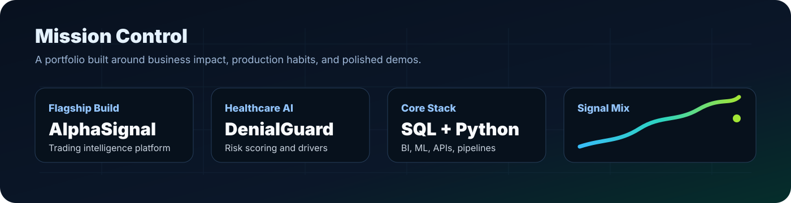
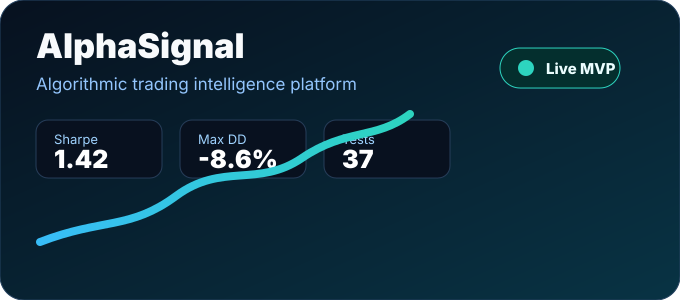
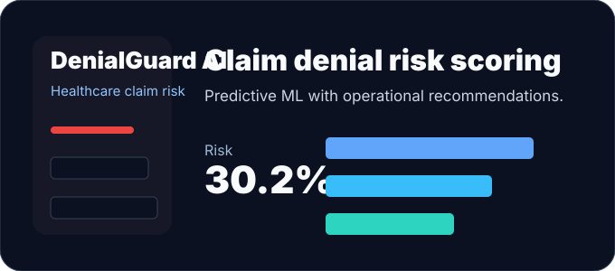
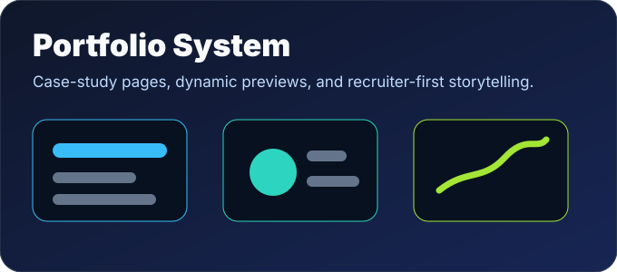
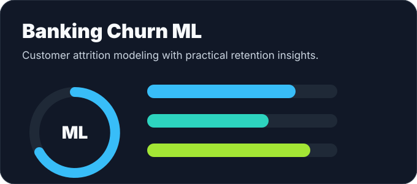
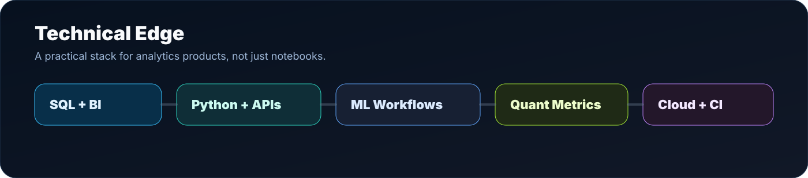

  

  
  
  

  <b>Data Analytics</b> • <b>Analytics Engineering</b> • <b>Machine Learning</b> • <b>Quant Finance Projects</b> • <b>Business Intelligence</b>

---

## Mission Control

I build analytics products that look polished, explain the business problem clearly, and prove the technical work underneath. My strongest work combines SQL, Python, BI dashboards, ML workflows, APIs, and portfolio-ready product storytelling.

**Current focus:** building finance-grade and operations-grade analytics projects that can stand up in interviews for Data Analyst, Analytics Engineer, Data Engineer, Quant Analytics, and ML-adjacent analytics roles.

---

## Signature Projects

<table>
  <tr>
    <td width="50%">
      
    </td>
    <td width="50%">
      
    </td>
  </tr>
  <tr>
    <td width="50%">
      
    </td>
    <td width="50%">
      
    </td>
  </tr>
</table>

---

## Technical Edge

**Analytics & BI:** SQL, Power BI, Tableau, Excel, KPI design, dashboard storytelling  
**Data Engineering:** Python, PostgreSQL, T-SQL, Snowflake, Microsoft Fabric, Azure, ETL pipelines  
**Machine Learning:** scikit-learn, forecasting, classification, NLP, model evaluation, feature engineering  
**Application Layer:** FastAPI, Streamlit, HTML/CSS/JavaScript, GitHub Actions, Docker  
**Finance Analytics:** backtesting, Sharpe ratio, drawdown, alpha/beta, portfolio optimization concepts

---

## How I Present My Work

- I lead with the business decision, not only the model.
- I document assumptions, evaluation metrics, limitations, and next steps.
- I make projects demo-ready with live pages, screenshots, clean READMEs, and clear architecture.
- I keep the work honest: reproducible code, tested logic, and specific metrics where available.

---

  <a href="https://shrut1261.github.io/analyst/">Portfolio</a>
  &nbsp;•&nbsp;
  <a href="https://github.com/Shrut1261/alphasignal-market-intelligence">AlphaSignal</a>
  &nbsp;•&nbsp;
  <a href="https://www.linkedin.com/in/shrutp/">LinkedIn</a>
  &nbsp;•&nbsp;
  <a href="mailto:shrutd.prajapati@gmail.com">Email</a>

